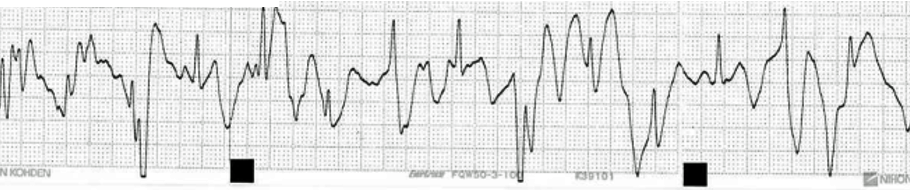
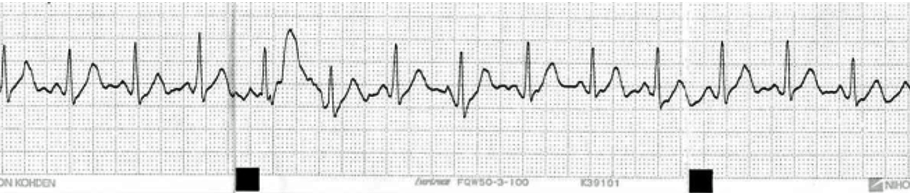

+++
title = "技術トピック１　ノイズレス電極"
date = 2019-03-06T16:15:53+09:00
draft = false

# Authors. Comma separated list, e.g. `["Bob Smith", "David Jones"]`.
authors = []

# Tags and categories
# For example, use `tags = []` for no tags, or the form `tags = ["A Tag", "Another Tag"]` for one or more tags.
tags = []
categories = []

# Projects (optional).
#   Associate this post with one or more of your projects.
#   Simply enter your project's folder or file name without extension.
#   E.g. `projects = ["deep-learning"]` references 
#   `content/project/deep-learning/index.md`.
#   Otherwise, set `projects = []`.
# projects = ["internal-project"]

# Featured image
# To use, add an image named `featured.jpg/png` to your page's folder. 
[image]
  # Caption (optional)
  caption = ""

  # Focal point (optional)
  # Options: Smart, Center, TopLeft, Top, TopRight, Left, Right, BottomLeft, Bottom, BottomRight
  focal_point = ""
+++
ノイズレス電極

汎用電極

ノイズレス電極    

汎用電極による歩行時の心電図は、静電気の影響で大きく揺れています。特に乾燥した冬季では顕著に現れ、モニター時のフォルスアラーム（誤アラーム）の原因となります。ノイズレス電極では体動に拠る影響は若干あるものの、静電気の影響は除去されており、フォルスアラームの低減に大きな効果を発揮します。

