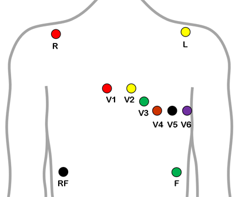

+++
title = "技術トピックス２　心電図シミュレーション"
date = 2019-03-06T15:53:20+09:00
draft = false

# Authors. Comma separated list, e.g. `["Bob Smith", "David Jones"]`.
authors = []

# Tags and categories
# For example, use `tags = []` for no tags, or the form `tags = ["A Tag", "Another Tag"]` for one or more tags.
tags = []
categories = []

# Projects (optional).
#   Associate this post with one or more of your projects.
#   Simply enter your project's folder or file name without extension.
#   E.g. `projects = ["deep-learning"]` references 
#   `content/project/deep-learning/index.md`.
#   Otherwise, set `projects = []`.
# projects = ["internal-project"]

# Featured image
# To use, add an image named `featured.jpg/png` to your page's folder. 
[image]
  # Caption (optional)
  caption = ""

  # Focal point (optional)
  # Options: Smart, Center, TopLeft, Top, TopRight, Left, Right, BottomLeft, Bottom, BottomRight
  focal_point = ""
+++
## 心電図シミュレーション

体表面心電図（単極誘導）をコンピューターシミュレーションで導出したものです。電極位置と得られる心電図を知る事ができます。
