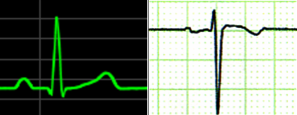

+++
title = "心電図・不整脈解析"
date = 2018-09-01T16:29:38+09:00
draft = false

# Authors. Comma separated list, e.g. `["Bob Smith", "David Jones"]`.
authors = ["HST Inc."]

# Tags and categories
# For example, use `tags = []` for no tags, or the form `tags = ["A Tag", "Another Tag"]` for one or more tags.
tags = []
categories = []

# Projects (optional).
#   Associate this post with one or more of your projects.
#   Simply enter your project's folder or file name without extension.
#   E.g. `projects = ["deep-learning"]` references 
#   `content/project/deep-learning/index.md`.
#   Otherwise, set `projects = []`.
projects = ["ecg"]

# Featured image
# To use, add an image named `featured.jpg/png` to your page's folder. 
[image]
  # Caption (optional)
  caption = ""

  # Focal point (optional)
  # Options: Smart, Center, TopLeft, Top, TopRight, Left, Right, BottomLeft, Bottom, BottomRight
  focal_point = ""
+++
12誘導心電図解析は入力アンプから解析ソフトウェアまで対応できます。IEC 60601-2-25:2011 の基準に適合した心電図解析を実現しています。

不整脈解析は1ch ECG から各種不整脈を検出するアルゴリズムを開発しています。

アンチエリアシングによりLCD上にスムースな波形描画を行います。
また、市販のインクジェットプリンタによりA4紙に美しい描画を行います。

