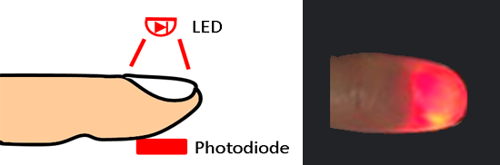

+++
title = "SpO2測定"
date = 2018-09-01T16:31:51+09:00
draft = false

# Authors. Comma separated list, e.g. `["Bob Smith", "David Jones"]`.
authors = ["HST Inc."]

# Tags and categories
# For example, use `tags = []` for no tags, or the form `tags = ["A Tag", "Another Tag"]` for one or more tags.
tags = []
categories = []

# Projects (optional).
#   Associate this post with one or more of your projects.
#   Simply enter your project's folder or file name without extension.
#   E.g. `projects = ["deep-learning"]` references 
#   `content/project/deep-learning/index.md`.
#   Otherwise, set `projects = []`.
projects = ["pulse-oximeter"]

# Featured image
# To use, add an image named `featured.jpg/png` to your page's folder. 
[image]
  # Caption (optional)
  caption = "青柳卓雄　パルスオキシメータの誕生とその理論"

  # Focal point (optional)
  # Options: Smart, Center, TopLeft, Top, TopRight, Left, Right, BottomLeft, Bottom, BottomRight
  focal_point = ""
+++
動脈血酸素飽和度(SpO2）計測は指に光を当て非観血的に動脈血の色を測定し酸素の割合を算出する技術です。

動脈血はSpO2が高い(97%)と紅く、低い(75%)と黒ずんできます。

指の動脈を通過したLEDの光でSpO2を測定します。

SpO2測定はセンサーおよびアンプ、計測アルゴリズムまでトータル設計が可能です。    
センサーはリユーザブルは勿論、ディスポーザブルタイプも開発しています。    
精度については臨床評価機関でのIEC 60601-2-61:2011 の基準に適合した実績を持っています。
